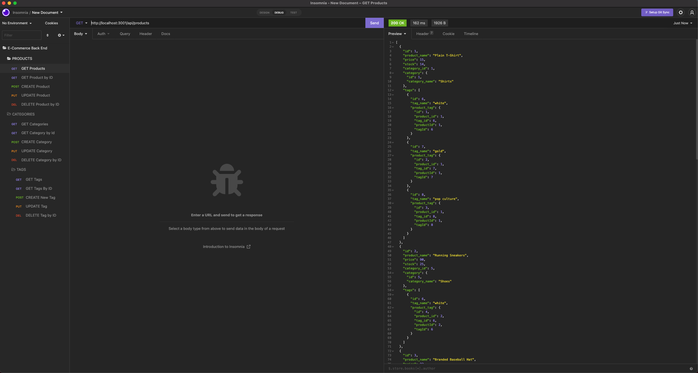
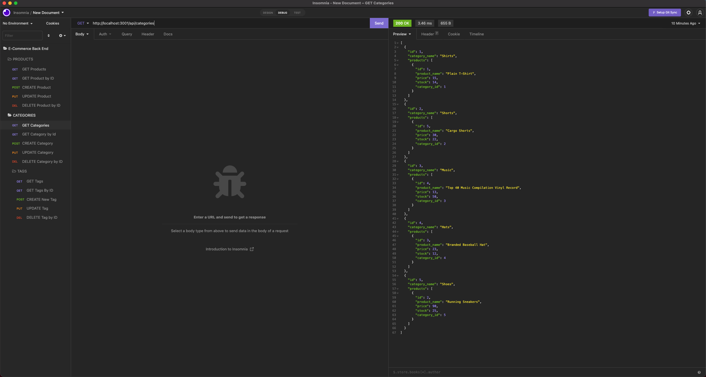
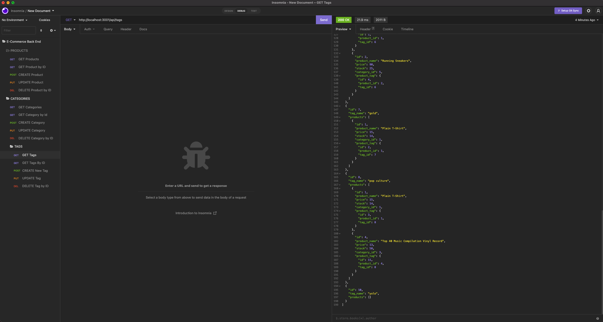

# E-Commerce-ORM

[](#license)

An API back end database for an e-commerce site that uses requests. It was built using Node.js, Express.js, MySQL and Sequelize.

## Description 
This project entailed building the back end for an e-commerce site with Node. Using MySQL and Sequelize, I created the database, models, and associations. I also used Express.js to create a functional API that performs CRUD operations on a database. 

## Technologies Used

- [Node.js](https://nodejs.org/)
- [Express.js](https://expressjs.com/)
- [Sequelize](https://sequelize.org/)

## Table of Contents

* [Installation](#installation)
* [Usage](#usage)
* [Credits](#credits)
* [License](#license)
* [Contributing](#contributing)

## Installation
  1. Upload all files or fork this repository to a server with a Node.js runtime environment and a MySQL Server. 
  2. Run `npm -i` from the root directory to install dependencies for this app. 
  3. Create a `.env` file in the root directory with this format: 
      ```
      DB_NAME=ecommerce_db
      DB_USER=(your user)
      DB_PASSWORD=(your password)
      ```
  4. From the root directory, open MySQL Shell and run `source ./db/schema.sql;` to create the database.
      - Optionally run `npm run seed` to populate the database with sample data.
  5. Run `npm start` to start the server.

## Usage 
Run `npm start` to start the server.

Access API endpoints to view, add, update, and delete categories, products and tags.

Products:




Categories:



Tags:



Walkthrough video: [Here](https://drive.google.com/file/d/18u0pT_7ycUpuXZkwjuFpnK0Q2TfPa_bo/view?usp=sharing)

## Credits
This application was built with the support of the resources and staff of the UCB Full Stack Full Time Coding Bootcamp Summer 2022. 

-W3 Schools


## License

```
MIT License
```

</details>

## Contributing
This project isn't currently acccepting contributions.

## Questions
- View my Github [profile](https://github.com/jeffz98)
- Contact me at my [email](mailto:jeffz98@berkeley.edu)